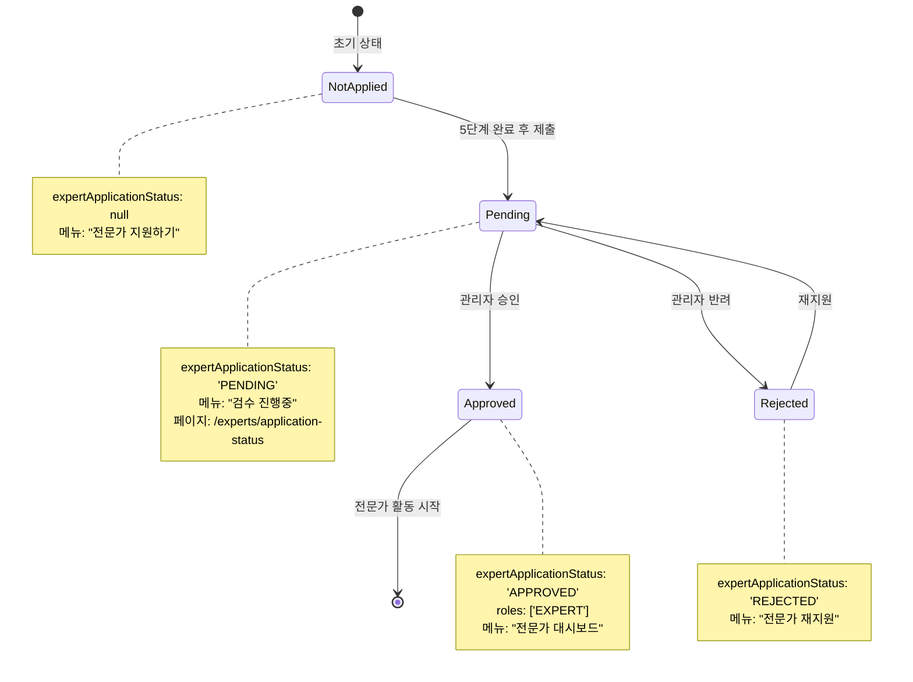

# 전문가 지원 상태 페이지 디자인 명세서

## 📋 개요

전문가 지원 후 5단계 제출 완료 시 진행현황을 확인할 수 있는 페이지 및 네비게이션 흐름 설계

## 🎯 요구사항

### 1. 사용자 플로우
```
전문가 지원하기 (5단계 완료)
  ↓ 제출 버튼 클릭
상태 업데이트: expertApplicationStatus = 'PENDING'
  ↓
진행현황 페이지로 리디렉션 (/experts/application-status)
  ↓
네비게이션 드롭다운 메뉴 변경: "전문가 지원하기" → "검수 진행중"
```

### 2. 상태 관리
- **PENDING**: 검수 진행 중
- **APPROVED**: 승인 완료 (전문가 대시보드 접근 가능)
- **REJECTED**: 반려 (재지원 가능)
- **null**: 미지원 상태 (지원 가능)

## 🎨 UI/UX 디자인

### A. 진행현황 페이지 개선 (/experts/application-status)

#### 현재 구조 분석
- ✅ 기본 상태 표시 (검수 기간, 결과 안내, 추가 서류)
- ⚠️ 부족한 점: 단계별 진행 상태 시각화, 타임라인 정보

#### 개선된 디자인

```tsx
/* 페이지 구조 */
1. 헤더 섹션
   - 상태 아이콘 (애니메이션)
   - 제목: "전문가 등록 신청이 접수되었습니다"
   - 부제: 신청 일시 표시

2. 진행 타임라인 (신규)
   [접수 완료] → [서류 검토] → [심사 진행중] → [승인 대기]
   - 현재 단계 하이라이트
   - 각 단계별 예상 소요 시간

3. 상세 정보 카드
   - 신청 정보 요약
     • 지원 카테고리
     • 전문 분야
     • 신청 일시
   - 검수 진행 상황
     • 현재 단계
     • 예상 완료 시간
     • 담당자 검토 상태

4. 안내 사항 섹션
   - 검수 프로세스 설명
   - 주의사항
   - FAQ 링크

5. 액션 버튼
   - "신청 내역 보기" (모달)
   - "홈으로 돌아가기"
   - "대시보드로 이동"

6. 푸터 섹션
   - 문의 연락처
   - 긴급 문의 채널
```

#### 컴포넌트 설계

```typescript
// 타임라인 단계 타입
type ApplicationStage =
  | 'SUBMITTED'      // 접수 완료
  | 'DOCUMENT_REVIEW' // 서류 검토
  | 'UNDER_REVIEW'   // 심사 진행
  | 'APPROVAL_PENDING' // 승인 대기
  | 'APPROVED'       // 승인 완료
  | 'REJECTED'       // 반려

interface TimelineStep {
  stage: ApplicationStage
  label: string
  description: string
  estimatedDays: number
  status: 'completed' | 'current' | 'pending'
}

// 진행 타임라인 컴포넌트
const ApplicationTimeline: React.FC<{
  currentStage: ApplicationStage
  submittedAt: Date
}> = ({ currentStage, submittedAt }) => {
  const steps: TimelineStep[] = [
    {
      stage: 'SUBMITTED',
      label: '접수 완료',
      description: '신청서가 성공적으로 제출되었습니다',
      estimatedDays: 0,
      status: 'completed'
    },
    {
      stage: 'DOCUMENT_REVIEW',
      label: '서류 검토',
      description: '제출하신 서류를 확인하고 있습니다',
      estimatedDays: 1,
      status: currentStage === 'DOCUMENT_REVIEW' ? 'current' : 'pending'
    },
    {
      stage: 'UNDER_REVIEW',
      label: '심사 진행',
      description: '전문가 자격을 심사하고 있습니다',
      estimatedDays: 2,
      status: currentStage === 'UNDER_REVIEW' ? 'current' : 'pending'
    },
    {
      stage: 'APPROVAL_PENDING',
      label: '최종 승인 대기',
      description: '최종 승인 단계입니다',
      estimatedDays: 1,
      status: currentStage === 'APPROVAL_PENDING' ? 'current' : 'pending'
    }
  ]

  return (
    <div className="bg-white rounded-xl shadow-sm border p-8">
      <h2 className="text-xl font-bold mb-6">진행 상황</h2>
      <div className="relative">
        {/* 타임라인 라인 */}
        <div className="absolute left-6 top-8 bottom-8 w-0.5 bg-gray-200" />

        {/* 각 단계 */}
        {steps.map((step, index) => (
          <div key={step.stage} className="relative flex gap-4 mb-8 last:mb-0">
            {/* 아이콘 */}
            <div className={`
              relative z-10 w-12 h-12 rounded-full flex items-center justify-center
              ${step.status === 'completed' ? 'bg-green-500' : ''}
              ${step.status === 'current' ? 'bg-blue-500 animate-pulse' : ''}
              ${step.status === 'pending' ? 'bg-gray-300' : ''}
            `}>
              {step.status === 'completed' && <CheckCircle className="w-6 h-6 text-white" />}
              {step.status === 'current' && <Clock className="w-6 h-6 text-white" />}
              {step.status === 'pending' && <Circle className="w-6 h-6 text-gray-500" />}
            </div>

            {/* 내용 */}
            <div className="flex-1 pt-1">
              <h3 className={`font-semibold mb-1 ${
                step.status === 'current' ? 'text-blue-600' : 'text-gray-900'
              }`}>
                {step.label}
              </h3>
              <p className="text-sm text-gray-600 mb-2">{step.description}</p>
              {step.status === 'current' && (
                <p className="text-xs text-blue-600 font-medium">
                  예상 소요: {step.estimatedDays}영업일
                </p>
              )}
            </div>
          </div>
        ))}
      </div>
    </div>
  )
}

// 신청 정보 요약 카드
const ApplicationSummaryCard: React.FC<{
  applicationData: any
}> = ({ applicationData }) => {
  return (
    <div className="bg-gradient-to-br from-blue-50 to-indigo-50 rounded-xl p-6 border border-blue-100">
      <h3 className="font-semibold text-gray-900 mb-4">신청 정보</h3>
      <div className="space-y-3">
        <div className="flex justify-between items-center">
          <span className="text-sm text-gray-600">지원 분야</span>
          <span className="font-medium text-gray-900">{applicationData.category}</span>
        </div>
        <div className="flex justify-between items-center">
          <span className="text-sm text-gray-600">세부 전문 분야</span>
          <span className="font-medium text-gray-900">{applicationData.specialty}</span>
        </div>
        <div className="flex justify-between items-center">
          <span className="text-sm text-gray-600">신청 일시</span>
          <span className="font-medium text-gray-900">
            {new Date(applicationData.submittedAt).toLocaleString('ko-KR')}
          </span>
        </div>
        <div className="flex justify-between items-center">
          <span className="text-sm text-gray-600">신청 번호</span>
          <span className="font-mono text-sm text-gray-900">
            #{applicationData.id?.toString().padStart(6, '0')}
          </span>
        </div>
      </div>

      <button className="w-full mt-4 py-2 border border-blue-300 text-blue-700 rounded-lg hover:bg-blue-100 transition-colors text-sm font-medium">
        신청 내역 전체 보기
      </button>
    </div>
  )
}

// 알림 설정 카드 (신규)
const NotificationSettings: React.FC = () => {
  const [emailNotification, setEmailNotification] = useState(true)
  const [smsNotification, setSmsNotification] = useState(false)

  return (
    <div className="bg-white rounded-xl shadow-sm border p-6">
      <h3 className="font-semibold text-gray-900 mb-4">알림 설정</h3>
      <div className="space-y-3">
        <label className="flex items-center justify-between cursor-pointer">
          <span className="text-sm text-gray-700">이메일 알림</span>
          <input
            type="checkbox"
            checked={emailNotification}
            onChange={(e) => setEmailNotification(e.target.checked)}
            className="w-5 h-5 text-blue-600 rounded"
          />
        </label>
        <label className="flex items-center justify-between cursor-pointer">
          <span className="text-sm text-gray-700">SMS 알림</span>
          <input
            type="checkbox"
            checked={smsNotification}
            onChange={(e) => setSmsNotification(e.target.checked)}
            className="w-5 h-5 text-blue-600 rounded"
          />
        </label>
      </div>
      <p className="text-xs text-gray-500 mt-3">
        검수 상태가 변경되면 선택하신 방법으로 알려드립니다
      </p>
    </div>
  )
}
```

### B. 네비게이션 드롭다운 메뉴 업데이트

#### 기존 로직 (Navbar.tsx:220-246)
```typescript
// 일반 사용자 - 전문가 지원 버튼
{!user?.roles?.includes('EXPERT') && (
  <button onClick={() => router.push("/experts/become")}>
    전문가 지원하기
  </button>
)}
```

#### 개선된 로직
```typescript
// 상태별 메뉴 라벨 및 동작 분기
{!user?.roles?.includes('EXPERT') && (
  <button
    onClick={() => {
      const status = (user as any)?.expertApplicationStatus

      // 상태별 라우팅
      if (status === 'PENDING') {
        router.push("/experts/application-status")
      } else if (status === 'APPROVED') {
        router.push("/dashboard/expert")
      } else if (status === 'REJECTED') {
        router.push("/experts/become?reapply=true")
      } else {
        router.push("/experts/become")
      }

      setShowUserMenu(false)
    }}
    className="w-full flex items-center px-4 py-2 text-sm hover:bg-gray-100"
  >
    {/* 아이콘 */}
    <span className="mr-3">
      {(() => {
        const status = (user as any)?.expertApplicationStatus
        if (status === 'PENDING') {
          return <Clock className="w-4 h-4 text-yellow-600 animate-pulse" />
        } else if (status === 'APPROVED') {
          return <CheckCircle2 className="w-4 h-4 text-green-600" />
        } else if (status === 'REJECTED') {
          return <ArrowLeftRight className="w-4 h-4 text-orange-600" />
        } else {
          return <ArrowLeftRight className="w-4 h-4" />
        }
      })()}
    </span>

    {/* 라벨 */}
    <span className={(() => {
      const status = (user as any)?.expertApplicationStatus
      if (status === 'PENDING') return 'text-yellow-700 font-medium'
      if (status === 'APPROVED') return 'text-green-700 font-medium'
      if (status === 'REJECTED') return 'text-orange-700'
      return 'text-gray-700'
    })()}>
      {(() => {
        const status = (user as any)?.expertApplicationStatus
        if (status === 'PENDING') return '검수 진행중'
        if (status === 'APPROVED') return '전문가 대시보드'
        if (status === 'REJECTED') return '전문가 재지원'
        return '전문가 지원하기'
      })()}
    </span>

    {/* 상태 뱃지 (PENDING일 때만) */}
    {(user as any)?.expertApplicationStatus === 'PENDING' && (
      <span className="ml-auto inline-flex items-center px-2 py-0.5 rounded-full text-xs font-medium bg-yellow-100 text-yellow-800">
        진행중
      </span>
    )}
  </button>
)}
```

## 🔄 상태 전환 플로우



## 📊 데이터 구조

### User 타입 확장
```typescript
interface User {
  id: string
  email: string
  name: string
  roles: ('USER' | 'EXPERT' | 'ADMIN')[]
  expertApplicationStatus?: 'PENDING' | 'APPROVED' | 'REJECTED' | null
  expertApplicationData?: {
    id: number
    categoryId: number
    category: string
    specialty: string
    submittedAt: Date
    reviewedAt?: Date
    currentStage: ApplicationStage
    reviewNotes?: string
  }
}
```

### API 엔드포인트

```typescript
// 전문가 지원 제출
POST /v1/experts/applications
Request: {
  categoryId: number
  specialty: string
  bio: string
  keywords: string[]
  // ... 기타 신청 정보
}
Response: {
  success: true
  data: {
    applicationId: number
    status: 'PENDING'
    submittedAt: string
  }
}

// 진행 상황 조회
GET /v1/experts/applications/status
Response: {
  success: true
  data: {
    id: number
    status: 'PENDING'
    currentStage: 'DOCUMENT_REVIEW'
    submittedAt: string
    estimatedCompletionDate: string
    categoryName: string
    specialty: string
  }
}

// 신청 상세 정보 조회
GET /v1/experts/applications/:id
Response: {
  success: true
  data: {
    // 전체 신청 정보
  }
}
```

## 🎯 구현 우선순위

### Phase 1: 핵심 기능 (High Priority)
1. ✅ 제출 시 상태 업데이트 (PENDING)
2. ✅ 네비게이션 메뉴 상태별 분기
3. ✅ 기본 진행현황 페이지
4. ✅ 리디렉션 로직

### Phase 2: 개선 기능 (Medium Priority)
5. 📊 타임라인 컴포넌트
6. 📋 신청 정보 요약 카드
7. 🔔 알림 설정 기능
8. 📧 이메일 알림 연동

### Phase 3: 고급 기능 (Low Priority)
9. 💬 실시간 상태 업데이트 (WebSocket)
10. 📱 모바일 푸시 알림
11. 📊 관리자 대시보드 연동
12. 📈 통계 및 분석

## 🎨 디자인 시스템

### 색상 팔레트
```css
/* 상태별 색상 */
--status-pending: #F59E0B   /* Yellow-500 */
--status-approved: #10B981  /* Green-500 */
--status-rejected: #F97316  /* Orange-500 */
--status-default: #6B7280   /* Gray-500 */

/* 배경 그라데이션 */
--gradient-pending: linear-gradient(to br, #FEF3C7, #FDE68A)
--gradient-info: linear-gradient(to br, #DBEAFE, #BFDBFE)
```

### 타이포그래피
```css
/* 헤더 */
.page-title { font-size: 2rem; font-weight: 700; }
.section-title { font-size: 1.25rem; font-weight: 600; }

/* 본문 */
.body-text { font-size: 0.875rem; line-height: 1.5; }
.caption { font-size: 0.75rem; color: #6B7280; }
```

### 애니메이션
```css
/* 펄스 애니메이션 (진행중 상태) */
@keyframes pulse {
  0%, 100% { opacity: 1; }
  50% { opacity: 0.6; }
}

/* 페이드인 애니메이션 */
@keyframes fadeIn {
  from { opacity: 0; transform: translateY(10px); }
  to { opacity: 1; transform: translateY(0); }
}
```

## 📱 반응형 디자인

### Mobile (< 640px)
- 타임라인: 세로 방향, 좌측 정렬
- 버튼: 전체 너비
- 카드: 단일 컬럼

### Tablet (640px - 1024px)
- 타임라인: 세로 방향, 여백 증가
- 버튼: 플렉스 배치
- 카드: 단일 컬럼

### Desktop (> 1024px)
- 타임라인: 세로 방향, 최대 너비 제한
- 버튼: 인라인 플렉스
- 카드: 2컬럼 가능

## ✅ 접근성 (A11y)

- ✅ ARIA 라벨: 모든 대화형 요소
- ✅ 키보드 네비게이션: Tab, Enter, Escape
- ✅ 스크린 리더: 상태 변경 안내
- ✅ 색상 대비: WCAG AA 준수 (4.5:1)
- ✅ 포커스 표시: 명확한 아웃라인

## 🧪 테스트 케이스

### 1. 제출 플로우
- [ ] 5단계 완료 → 제출 버튼 활성화
- [ ] 제출 성공 → PENDING 상태로 변경
- [ ] 진행현황 페이지로 자동 리디렉션
- [ ] 네비게이션 메뉴 라벨 변경 확인

### 2. 상태별 네비게이션
- [ ] PENDING: "검수 진행중" → /experts/application-status
- [ ] APPROVED: "전문가 대시보드" → /dashboard/expert
- [ ] REJECTED: "전문가 재지원" → /experts/become?reapply=true
- [ ] null: "전문가 지원하기" → /experts/become

### 3. 진행현황 페이지
- [ ] 타임라인 현재 단계 하이라이트
- [ ] 신청 정보 정확히 표시
- [ ] 알림 설정 저장 기능
- [ ] 모바일 반응형 레이아웃

### 4. 에러 처리
- [ ] 미인증 사용자 → 로그인 페이지
- [ ] 네트워크 오류 → 에러 메시지 표시
- [ ] 잘못된 상태 → 기본 페이지로 리디렉션

## 📝 구현 체크리스트

### Backend (API)
- [ ] ExpertApplication 모델 확장 (currentStage 필드 추가)
- [ ] POST /experts/applications 엔드포인트 개선
- [ ] GET /experts/applications/status 엔드포인트 생성
- [ ] User 응답에 expertApplicationData 포함
- [ ] 이메일 알림 서비스 연동

### Frontend (Web)
- [ ] ApplicationTimeline 컴포넌트 생성
- [ ] ApplicationSummaryCard 컴포넌트 생성
- [ ] NotificationSettings 컴포넌트 생성
- [ ] /experts/application-status 페이지 개선
- [ ] Navbar 드롭다운 메뉴 로직 업데이트
- [ ] 상태별 아이콘 및 색상 적용
- [ ] 모바일 반응형 스타일링

### Testing
- [ ] Unit 테스트: 컴포넌트 렌더링
- [ ] Integration 테스트: API 연동
- [ ] E2E 테스트: 전체 플로우
- [ ] 접근성 테스트: WCAG 준수

## 🚀 배포 전 확인사항

- [ ] 모든 테스트 통과
- [ ] 코드 리뷰 완료
- [ ] 디자인 QA 승인
- [ ] 성능 최적화 확인
- [ ] 보안 검토 완료
- [ ] 문서 업데이트
- [ ] 스테이징 환경 테스트

---

**작성일**: 2025-10-02
**작성자**: Claude (Frontend Architect Persona)
**버전**: 1.0.0
