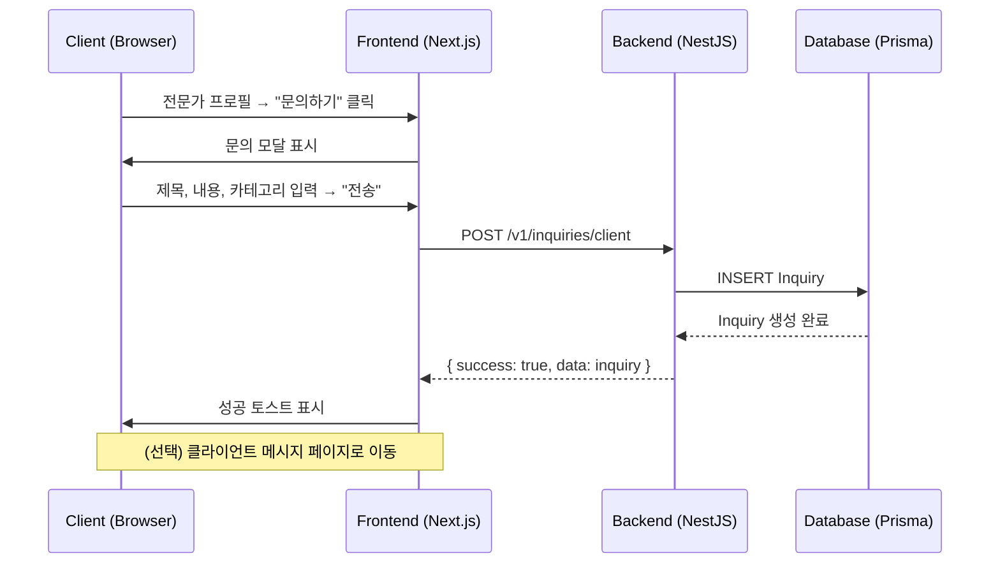
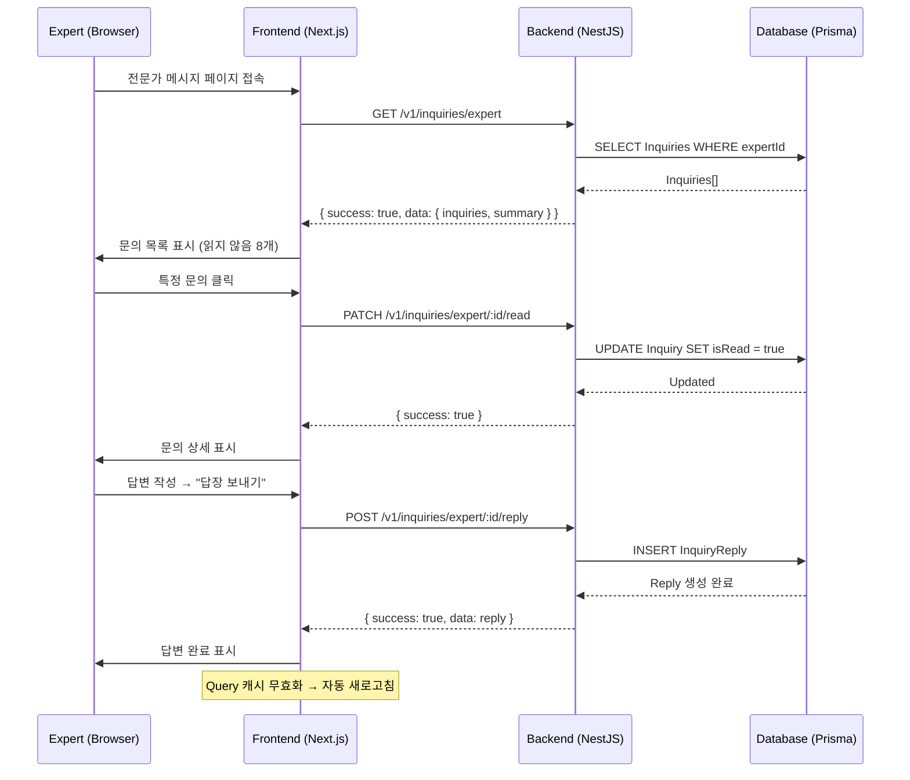
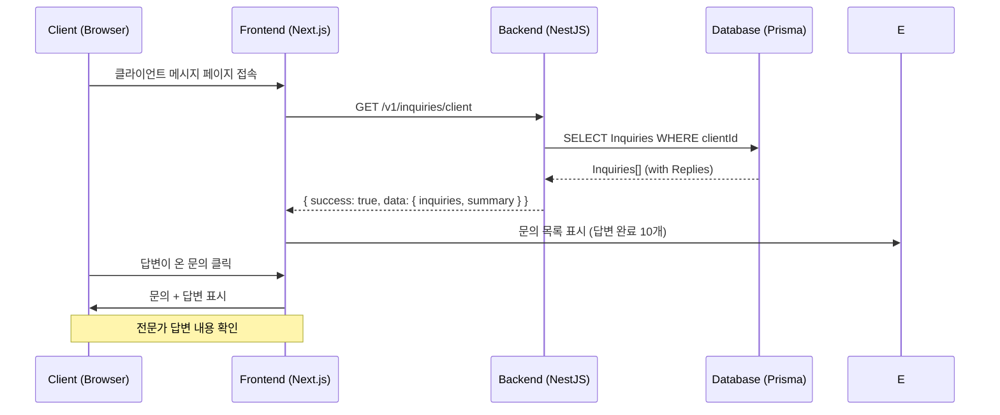

# 메시징 시스템 구현 계획서
**작성일**: 2025-10-24
**버전**: 1.0

---

## 📋 목차
1. [개요](#개요)
2. [현재 상황 분석](#현재-상황-분석)
3. [시스템 아키텍처](#시스템-아키텍처)
4. [데이터베이스 설계](#데이터베이스-설계)
5. [백엔드 API 설계](#백엔드-api-설계)
6. [프론트엔드 통합](#프론트엔드-통합)
7. [데이터 흐름](#데이터-흐름)
8. [구현 단계](#구현-단계)
9. [보안 고려사항](#보안-고려사항)
10. [확장 가능성](#확장-가능성)

---

## 개요

### 목적
전문가 찾기 페이지의 전문가 프로필 "문의하기" 버튼과 클라이언트/전문가 메시지 관리 페이지를 연동하여 완전한 메시징 시스템을 구축합니다.

### 범위
- **클라이언트**: 전문가에게 문의 전송, 답변 확인
- **전문가**: 받은 문의 확인, 답변 작성
- **양방향 통신**: 문의 → 답변 (1:1)

### 주요 기능
1. 전문가 프로필에서 "문의하기" 버튼 클릭 → 문의 전송
2. 클라이언트 메시지 관리 페이지에서 전송한 문의 및 답변 확인
3. 전문가 메시지 관리 페이지에서 받은 문의 확인 및 답변 작성
4. 읽음/답변 상태 관리
5. 검색 및 필터링 기능

---

## 현재 상황 분석

### 구현 완료 항목 ✅
1. **프론트엔드 UI**
   - [ExpertProfileDetail.tsx](../apps/web/src/components/experts/ExpertProfileDetail.tsx): "문의하기" 모달 UI (1574~1746줄)
   - [ClientMessagesPage](../apps/web/src/app/dashboard/client/messages/page.tsx): 클라이언트 메시지 관리 UI (데모 데이터)
   - [ExpertMessagesPage](../apps/web/src/app/dashboard/expert/messages/page.tsx): 전문가 메시지 관리 UI (데모 데이터)

### 구현 필요 항목 🔴
1. **백엔드**
   - Inquiry 데이터 모델 (Prisma schema)
   - Inquiry API 엔드포인트 (NestJS)
   - 권한 검증 로직

2. **프론트엔드**
   - API 클라이언트 함수
   - React Query 통합
   - 실제 데이터 연동

3. **현재 TODO 항목**
   - `ExpertProfileDetail.tsx:260` - `handleSendInquiry` API 연동
   - `ClientMessagesPage:32` - 문의 목록 API 연동
   - `ExpertMessagesPage:30` - 답변 작성 API 연동

---

## 시스템 아키텍처

### 전체 구조
```
┌──────────────────────────────────────────────────────────────┐
│                    프론트엔드 (Next.js)                       │
├──────────────────────────────────────────────────────────────┤
│  ┌────────────────┐  ┌────────────────┐  ┌────────────────┐ │
│  │ ExpertProfile  │  │ ClientMessages │  │ ExpertMessages │ │
│  │    Detail      │  │     Page       │  │     Page       │ │
│  └────────┬───────┘  └────────┬───────┘  └────────┬───────┘ │
│           │                   │                    │          │
│           └───────────────────┴────────────────────┘          │
│                              │                                │
│                    ┌─────────▼─────────┐                     │
│                    │  Inquiry API      │                     │
│                    │  Client Library   │                     │
│                    └─────────┬─────────┘                     │
└──────────────────────────────┼──────────────────────────────┘
                               │ HTTP/REST
┌──────────────────────────────▼──────────────────────────────┐
│                    백엔드 (NestJS)                            │
├──────────────────────────────────────────────────────────────┤
│  ┌────────────────────────────────────────────────────────┐ │
│  │           Inquiry Module                               │ │
│  │  ┌─────────────┐  ┌─────────────┐  ┌─────────────┐   │ │
│  │  │  Controller │→ │   Service   │→ │   Prisma    │   │ │
│  │  └─────────────┘  └─────────────┘  └─────────────┘   │ │
│  └────────────────────────────────────────────────────────┘ │
└──────────────────────────────┬──────────────────────────────┘
                               │
┌──────────────────────────────▼──────────────────────────────┐
│                  데이터베이스 (PostgreSQL)                    │
├──────────────────────────────────────────────────────────────┤
│  ┌────────────┐         ┌──────────────┐                    │
│  │  Inquiry   │◄───────►│ InquiryReply │                    │
│  └──────┬─────┘         └──────────────┘                    │
│         │                                                     │
│  ┌──────▼─────┐                                             │
│  │    User    │                                             │
│  │(Client/Expert)                                           │
│  └────────────┘                                             │
└──────────────────────────────────────────────────────────────┘
```

### 데이터 흐름
```
클라이언트 → 문의 생성 → 백엔드 → DB 저장
                         ↓
전문가 → 문의 조회 ← 백엔드 ← DB 조회
         ↓
전문가 → 답변 작성 → 백엔드 → DB 저장
                         ↓
클라이언트 → 답변 확인 ← 백엔드 ← DB 조회
```

---

## 데이터베이스 설계

### Prisma Schema

```prisma
// ==========================================
// Inquiry (문의) 모델
// ==========================================
model Inquiry {
  id          String   @id @default(cuid())

  // 관계
  clientId    Int      // 문의를 보낸 클라이언트
  client      User     @relation("ClientInquiries", fields: [clientId], references: [id], onDelete: Cascade)
  expertId    Int      // 문의를 받은 전문가
  expert      User     @relation("ExpertInquiries", fields: [expertId], references: [id], onDelete: Cascade)

  // 문의 내용
  subject     String   @db.VarChar(200) // 제목 (최대 200자)
  content     String   @db.Text         // 본문 (긴 텍스트)
  category    InquiryCategory          // 문의 카테고리

  // 상태 관리
  isRead      Boolean  @default(false)  // 전문가가 읽었는지

  // 답변 (1:1 관계)
  reply       InquiryReply?

  // 타임스탬프
  createdAt   DateTime @default(now())
  updatedAt   DateTime @updatedAt

  // 인덱스 최적화
  @@index([clientId, createdAt])                    // 클라이언트 문의 조회
  @@index([expertId, isRead, createdAt])           // 전문가 읽지 않은 문의 조회
  @@index([expertId, createdAt])                   // 전문가 전체 문의 조회

  @@map("inquiries")
}

// ==========================================
// InquiryCategory (문의 카테고리)
// ==========================================
enum InquiryCategory {
  SCHEDULE  // 상담 일정 문의
  TIME      // 상담 시간 문의
  PRICE     // 상담 비용 문의
  METHOD    // 상담 방식 문의
  OTHER     // 기타 문의

  @@map("inquiry_category")
}

// ==========================================
// InquiryReply (답변) 모델
// ==========================================
model InquiryReply {
  id          String   @id @default(cuid())

  // 1:1 관계
  inquiryId   String   @unique
  inquiry     Inquiry  @relation(fields: [inquiryId], references: [id], onDelete: Cascade)

  // 답변 내용
  content     String   @db.Text

  // 타임스탬프
  createdAt   DateTime @default(now())
  updatedAt   DateTime @updatedAt

  @@map("inquiry_replies")
}

// ==========================================
// User 모델에 관계 추가
// ==========================================
model User {
  // ... 기존 필드들

  // Inquiry 관계
  clientInquiries  Inquiry[]  @relation("ClientInquiries")
  expertInquiries  Inquiry[]  @relation("ExpertInquiries")
}
```

### 데이터베이스 마이그레이션

```bash
# 1. Schema 수정 후 마이그레이션 생성
npx prisma migrate dev --name add_inquiry_system

# 2. Prisma Client 재생성
npx prisma generate

# 3. 마이그레이션 상태 확인
npx prisma migrate status
```

### 데이터 예시

```json
// Inquiry 레코드
{
  "id": "clxx1234567890",
  "clientId": 5,
  "expertId": 3,
  "subject": "상담 일정 문의드립니다",
  "content": "다음 주 월요일 오후 2시에 상담이 가능한가요?",
  "category": "SCHEDULE",
  "isRead": true,
  "createdAt": "2025-10-24T10:30:00Z",
  "updatedAt": "2025-10-24T11:00:00Z"
}

// InquiryReply 레코드
{
  "id": "clxx0987654321",
  "inquiryId": "clxx1234567890",
  "content": "네, 다음 주 월요일 오후 2시에 상담 가능합니다.",
  "createdAt": "2025-10-24T11:00:00Z",
  "updatedAt": "2025-10-24T11:00:00Z"
}
```

---

## 백엔드 API 설계

### 디렉토리 구조

```
apps/api/src/inquiry/
├── inquiry.module.ts           # NestJS 모듈
├── inquiry.controller.ts       # REST API 컨트롤러
├── inquiry.service.ts          # 비즈니스 로직
├── dto/
│   ├── create-inquiry.dto.ts   # 문의 생성 DTO
│   ├── create-reply.dto.ts     # 답변 생성 DTO
│   ├── query-inquiry.dto.ts    # 조회 쿼리 DTO
│   └── inquiry-response.dto.ts # 응답 DTO
└── guards/
    └── inquiry-ownership.guard.ts # 소유권 검증
```

### API 엔드포인트 명세

#### 1. 클라이언트용 API

##### **POST /v1/inquiries/client** - 문의 생성
```typescript
// Request
{
  "expertId": 3,
  "subject": "상담 일정 문의드립니다",
  "content": "다음 주 월요일 오후 2시에 상담이 가능한가요?",
  "category": "schedule"  // schedule | time | price | method | other
}

// Response (201 Created)
{
  "success": true,
  "data": {
    "id": "clxx1234567890",
    "subject": "상담 일정 문의드립니다",
    "content": "다음 주 월요일 오후 2시에 상담이 가능한가요?",
    "category": "schedule",
    "expertName": "김철수",
    "expertEmail": "expert@example.com",
    "isRead": false,
    "hasReply": false,
    "createdAt": "2025-10-24T10:30:00Z"
  }
}
```

##### **GET /v1/inquiries/client** - 내가 보낸 문의 목록
```typescript
// Query Parameters
?status=all|unread|replied  // 필터 (기본: all)
&search=검색어               // 검색어 (선택)
&page=1                     // 페이지 번호 (기본: 1)
&limit=20                   // 페이지당 개수 (기본: 20)

// Response (200 OK)
{
  "success": true,
  "data": {
    "inquiries": [
      {
        "id": "clxx1234567890",
        "subject": "상담 일정 문의드립니다",
        "content": "다음 주 월요일 오후 2시에...",
        "category": "schedule",
        "expertName": "김철수",
        "expertEmail": "expert@example.com",
        "expertProfileImage": "https://...",
        "isRead": true,
        "hasReply": true,
        "reply": {
          "content": "네, 가능합니다.",
          "repliedAt": "2025-10-24T11:00:00Z"
        },
        "createdAt": "2025-10-24T10:30:00Z",
        "updatedAt": "2025-10-24T11:00:00Z"
      }
    ],
    "pagination": {
      "total": 15,
      "page": 1,
      "limit": 20,
      "totalPages": 1
    },
    "summary": {
      "total": 15,
      "unread": 3,
      "replied": 10
    }
  }
}
```

##### **GET /v1/inquiries/client/:id** - 문의 상세 조회
```typescript
// Response (200 OK)
{
  "success": true,
  "data": {
    "id": "clxx1234567890",
    "subject": "상담 일정 문의드립니다",
    "content": "다음 주 월요일 오후 2시에 상담이 가능한가요?",
    "category": "schedule",
    "expert": {
      "id": 3,
      "displayId": "expert-123",
      "name": "김철수",
      "email": "expert@example.com",
      "profileImage": "https://...",
      "specialty": "경력 상담"
    },
    "isRead": true,
    "reply": {
      "id": "clxx0987654321",
      "content": "네, 다음 주 월요일 오후 2시에 상담 가능합니다.",
      "createdAt": "2025-10-24T11:00:00Z"
    },
    "createdAt": "2025-10-24T10:30:00Z",
    "updatedAt": "2025-10-24T11:00:00Z"
  }
}
```

##### **DELETE /v1/inquiries/client/:id** - 문의 삭제
```typescript
// Response (200 OK)
{
  "success": true,
  "message": "문의가 삭제되었습니다."
}
```

---

#### 2. 전문가용 API

##### **GET /v1/inquiries/expert** - 받은 문의 목록
```typescript
// Query Parameters
?status=all|unread|replied  // 필터 (기본: all)
&search=검색어               // 검색어 (선택)
&page=1                     // 페이지 번호 (기본: 1)
&limit=20                   // 페이지당 개수 (기본: 20)

// Response (200 OK)
{
  "success": true,
  "data": {
    "inquiries": [
      {
        "id": "clxx1234567890",
        "subject": "상담 일정 문의드립니다",
        "content": "다음 주 월요일 오후 2시에...",
        "category": "schedule",
        "clientName": "이영희",
        "clientEmail": "client@example.com",
        "isRead": false,
        "hasReply": false,
        "createdAt": "2025-10-24T10:30:00Z",
        "updatedAt": "2025-10-24T10:30:00Z"
      }
    ],
    "pagination": {
      "total": 25,
      "page": 1,
      "limit": 20,
      "totalPages": 2
    },
    "summary": {
      "total": 25,
      "unread": 8,
      "replied": 15
    }
  }
}
```

##### **GET /v1/inquiries/expert/:id** - 문의 상세 조회
```typescript
// Response (200 OK)
{
  "success": true,
  "data": {
    "id": "clxx1234567890",
    "subject": "상담 일정 문의드립니다",
    "content": "다음 주 월요일 오후 2시에 상담이 가능한가요?",
    "category": "schedule",
    "client": {
      "id": 5,
      "name": "이영희",
      "email": "client@example.com"
    },
    "isRead": true,
    "reply": null,
    "createdAt": "2025-10-24T10:30:00Z",
    "updatedAt": "2025-10-24T10:35:00Z"
  }
}
```

##### **PATCH /v1/inquiries/expert/:id/read** - 읽음 표시
```typescript
// Response (200 OK)
{
  "success": true,
  "data": {
    "id": "clxx1234567890",
    "isRead": true
  }
}
```

##### **POST /v1/inquiries/expert/:id/reply** - 답변 작성
```typescript
// Request
{
  "content": "네, 다음 주 월요일 오후 2시에 상담 가능합니다."
}

// Response (201 Created)
{
  "success": true,
  "data": {
    "replyId": "clxx0987654321",
    "inquiryId": "clxx1234567890",
    "content": "네, 다음 주 월요일 오후 2시에 상담 가능합니다.",
    "createdAt": "2025-10-24T11:00:00Z"
  }
}
```

##### **DELETE /v1/inquiries/expert/:id** - 문의 삭제
```typescript
// Response (200 OK)
{
  "success": true,
  "message": "문의가 삭제되었습니다."
}
```

##### **GET /v1/inquiries/expert/stats** - 통계 조회
```typescript
// Response (200 OK)
{
  "success": true,
  "data": {
    "total": 25,
    "unread": 8,
    "replied": 15,
    "pending": 10,
    "todayReceived": 3,
    "avgResponseTime": "2.5 hours"  // 평균 답변 시간
  }
}
```

### 에러 응답

```typescript
// 400 Bad Request - 유효성 검증 실패
{
  "success": false,
  "error": {
    "code": "VALIDATION_ERROR",
    "message": "입력 데이터가 올바르지 않습니다.",
    "details": [
      {
        "field": "subject",
        "message": "제목은 필수입니다."
      }
    ]
  }
}

// 401 Unauthorized - 인증 실패
{
  "success": false,
  "error": {
    "code": "UNAUTHORIZED",
    "message": "인증이 필요합니다."
  }
}

// 403 Forbidden - 권한 없음
{
  "success": false,
  "error": {
    "code": "FORBIDDEN",
    "message": "이 문의에 접근할 권한이 없습니다."
  }
}

// 404 Not Found - 리소스 없음
{
  "success": false,
  "error": {
    "code": "NOT_FOUND",
    "message": "문의를 찾을 수 없습니다."
  }
}

// 500 Internal Server Error - 서버 오류
{
  "success": false,
  "error": {
    "code": "INTERNAL_ERROR",
    "message": "서버 오류가 발생했습니다."
  }
}
```

---

## 프론트엔드 통합

### API 클라이언트 라이브러리

**파일**: `/apps/web/src/lib/inquiries.ts`

```typescript
import { api } from './api';

// ==========================================
// 타입 정의
// ==========================================
export interface CreateInquiryRequest {
  expertId: number;
  subject: string;
  content: string;
  category: 'schedule' | 'time' | 'price' | 'method' | 'other';
}

export interface QueryInquiryParams {
  status?: 'all' | 'unread' | 'replied';
  search?: string;
  page?: number;
  limit?: number;
}

export interface Inquiry {
  id: string;
  subject: string;
  content: string;
  category: string;
  isRead: boolean;
  hasReply: boolean;
  reply?: {
    content: string;
    repliedAt: string;
  };
  createdAt: string;
  updatedAt: string;
  // 클라이언트용: expert 정보
  expertName?: string;
  expertEmail?: string;
  expertProfileImage?: string;
  // 전문가용: client 정보
  clientName?: string;
  clientEmail?: string;
}

export interface InquiryListResponse {
  inquiries: Inquiry[];
  pagination: {
    total: number;
    page: number;
    limit: number;
    totalPages: number;
  };
  summary: {
    total: number;
    unread: number;
    replied: number;
  };
}

// ==========================================
// 클라이언트용 API
// ==========================================

/**
 * 문의 생성
 */
export async function createInquiry(data: CreateInquiryRequest) {
  const response = await api.post('/inquiries/client', data);
  return response;
}

/**
 * 내가 보낸 문의 목록 조회
 */
export async function getClientInquiries(params?: QueryInquiryParams) {
  const response = await api.get<InquiryListResponse>('/inquiries/client', { params });
  return response;
}

/**
 * 문의 상세 조회
 */
export async function getClientInquiry(id: string) {
  const response = await api.get(`/inquiries/client/${id}`);
  return response;
}

/**
 * 문의 삭제
 */
export async function deleteClientInquiry(id: string) {
  const response = await api.delete(`/inquiries/client/${id}`);
  return response;
}

// ==========================================
// 전문가용 API
// ==========================================

/**
 * 받은 문의 목록 조회
 */
export async function getExpertInquiries(params?: QueryInquiryParams) {
  const response = await api.get<InquiryListResponse>('/inquiries/expert', { params });
  return response;
}

/**
 * 받은 문의 상세 조회
 */
export async function getExpertInquiry(id: string) {
  const response = await api.get(`/inquiries/expert/${id}`);
  return response;
}

/**
 * 문의를 읽음으로 표시
 */
export async function markInquiryAsRead(id: string) {
  const response = await api.patch(`/inquiries/expert/${id}/read`);
  return response;
}

/**
 * 문의에 답변 작성
 */
export async function replyToInquiry(id: string, content: string) {
  const response = await api.post(`/inquiries/expert/${id}/reply`, { content });
  return response;
}

/**
 * 문의 삭제
 */
export async function deleteExpertInquiry(id: string) {
  const response = await api.delete(`/inquiries/expert/${id}`);
  return response;
}

/**
 * 통계 조회
 */
export async function getExpertInquiryStats() {
  const response = await api.get('/inquiries/expert/stats');
  return response;
}
```

### React Query 통합

#### 1. **ExpertProfileDetail.tsx 수정**

**파일**: `/apps/web/src/components/experts/ExpertProfileDetail.tsx`
**라인**: 250-273

```typescript
import { createInquiry } from '@/lib/inquiries';
import { useMutation } from '@tanstack/react-query';

// ... 기존 코드

// Mutation 정의 (컴포넌트 상단)
const createInquiryMutation = useMutation({
  mutationFn: createInquiry,
  onSuccess: () => {
    showToast('문의가 전송되었습니다. 전문가가 확인 후 답변드리겠습니다.', 'success');
    setIsInquiryModalOpen(false);
    setInquirySubject('');
    setInquiryContent('');
    setInquiryTab('schedule');
  },
  onError: (error: any) => {
    console.error('문의 전송 실패:', error);
    showToast(
      error?.response?.data?.error?.message || '문의 전송에 실패했습니다. 다시 시도해주세요.',
      'error'
    );
  }
});

// handleSendInquiry 수정
const handleSendInquiry = async () => {
  if (!inquirySubject.trim() || !inquiryContent.trim()) {
    showToast('제목과 내용을 모두 입력해주세요.', 'warning');
    return;
  }

  createInquiryMutation.mutate({
    expertId: expertData.id,
    subject: inquirySubject,
    content: inquiryContent,
    category: inquiryTab  // 'schedule' | 'time' | 'price' | 'method' | 'other'
  });
};

// 버튼 수정 (isSendingInquiry → createInquiryMutation.isPending)
<Button
  onClick={handleSendInquiry}
  disabled={!inquirySubject.trim() || !inquiryContent.trim() || createInquiryMutation.isPending}
>
  {createInquiryMutation.isPending ? (
    <div className="flex items-center gap-2">
      <div className="animate-spin rounded-full h-4 w-4 border-b-2 border-white"></div>
      전송 중...
    </div>
  ) : (
    '문의 보내기'
  )}
</Button>
```

#### 2. **ClientMessagesPage 수정**

**파일**: `/apps/web/src/app/dashboard/client/messages/page.tsx`

```typescript
import { useQuery, useMutation, useQueryClient } from '@tanstack/react-query';
import { getClientInquiries, deleteClientInquiry } from '@/lib/inquiries';

export default function ClientMessagesPage() {
  const { isAuthenticated, user } = useAuth();
  const queryClient = useQueryClient();
  const [selectedMessage, setSelectedMessage] = useState<string | null>(null);
  const [filterStatus, setFilterStatus] = useState<'all' | 'unread' | 'replied'>('all');
  const [searchQuery, setSearchQuery] = useState('');

  // 문의 목록 조회
  const { data, isLoading, error } = useQuery({
    queryKey: ['client-inquiries', filterStatus, searchQuery],
    queryFn: () => getClientInquiries({
      status: filterStatus,
      search: searchQuery || undefined,
      limit: 50
    }),
    enabled: !!isAuthenticated
  });

  // 문의 삭제 mutation
  const deleteMutation = useMutation({
    mutationFn: deleteClientInquiry,
    onSuccess: () => {
      queryClient.invalidateQueries({ queryKey: ['client-inquiries'] });
      setSelectedMessage(null);
    }
  });

  const messages = data?.data?.inquiries || [];
  const summary = data?.data?.summary || { total: 0, unread: 0, replied: 0 };

  const handleDeleteMessage = (messageId: string) => {
    if (!confirm('이 메시지를 삭제하시겠습니까?')) return;
    deleteMutation.mutate(messageId);
  };

  // ... 나머지 UI 로직
}
```

#### 3. **ExpertMessagesPage 수정**

**파일**: `/apps/web/src/app/dashboard/expert/messages/page.tsx`

```typescript
import { useQuery, useMutation, useQueryClient } from '@tanstack/react-query';
import {
  getExpertInquiries,
  markInquiryAsRead,
  replyToInquiry,
  deleteExpertInquiry
} from '@/lib/inquiries';

export default function ExpertMessagesPage() {
  const { isAuthenticated, user } = useAuth();
  const queryClient = useQueryClient();
  const [selectedMessage, setSelectedMessage] = useState<string | null>(null);
  const [filterStatus, setFilterStatus] = useState<'all' | 'unread' | 'replied'>('all');
  const [searchQuery, setSearchQuery] = useState('');
  const [replyText, setReplyText] = useState('');

  // 문의 목록 조회
  const { data, isLoading } = useQuery({
    queryKey: ['expert-inquiries', filterStatus, searchQuery],
    queryFn: () => getExpertInquiries({
      status: filterStatus,
      search: searchQuery || undefined,
      limit: 50
    }),
    enabled: !!isAuthenticated
  });

  // 읽음 표시 mutation
  const markAsReadMutation = useMutation({
    mutationFn: markInquiryAsRead,
    onSuccess: () => {
      queryClient.invalidateQueries({ queryKey: ['expert-inquiries'] });
    }
  });

  // 답변 전송 mutation
  const replyMutation = useMutation({
    mutationFn: ({ id, content }: { id: string; content: string }) =>
      replyToInquiry(id, content),
    onSuccess: () => {
      queryClient.invalidateQueries({ queryKey: ['expert-inquiries'] });
      setReplyText('');
      alert('답장이 전송되었습니다.');
    },
    onError: (error: any) => {
      console.error('답장 전송 실패:', error);
      alert('답장 전송에 실패했습니다.');
    }
  });

  // 문의 삭제 mutation
  const deleteMutation = useMutation({
    mutationFn: deleteExpertInquiry,
    onSuccess: () => {
      queryClient.invalidateQueries({ queryKey: ['expert-inquiries'] });
      setSelectedMessage(null);
    }
  });

  const messages = data?.data?.inquiries || [];
  const summary = data?.data?.summary || { total: 0, unread: 0, replied: 0 };

  const handleSelectMessage = (messageId: string) => {
    setSelectedMessage(messageId);

    const message = messages.find(m => m.id === messageId);
    if (message && !message.isRead) {
      markAsReadMutation.mutate(messageId);
    }
  };

  const handleSendReply = () => {
    if (!selectedMessage || !replyText.trim()) return;
    replyMutation.mutate({
      id: selectedMessage,
      content: replyText
    });
  };

  const handleDeleteMessage = (messageId: string) => {
    if (!confirm('이 메시지를 삭제하시겠습니까?')) return;
    deleteMutation.mutate(messageId);
  };

  // ... 나머지 UI 로직
}
```

---

## 데이터 흐름

### 시나리오 1: 클라이언트 → 전문가 문의



### 시나리오 2: 전문가 → 문의 확인 및 답변



### 시나리오 3: 클라이언트 → 답변 확인



### 상태 관리 흐름

```
┌─────────────────────────────────────────────────────────────┐
│                   React Query 캐싱 전략                      │
├─────────────────────────────────────────────────────────────┤
│                                                               │
│  Query Keys:                                                 │
│  - ['client-inquiries', filterStatus, searchQuery]           │
│  - ['expert-inquiries', filterStatus, searchQuery]           │
│  - ['inquiry-stats']                                         │
│                                                               │
│  Invalidation (자동 새로고침):                                │
│  - 문의 생성 → ['client-inquiries'] 무효화                   │
│  - 답변 작성 → ['expert-inquiries'] 무효화                   │
│  - 문의 삭제 → 해당 목록 무효화                               │
│                                                               │
│  Optimistic Updates:                                         │
│  - 읽음 표시: UI 즉시 업데이트 → API 호출                    │
│  - 삭제: UI 즉시 제거 → API 호출                            │
│                                                               │
└─────────────────────────────────────────────────────────────┘
```

---

## 구현 단계

### Phase 1: 데이터베이스 마이그레이션 (예상 30분)

**작업 항목**:
1. ✅ Prisma schema에 `Inquiry`, `InquiryReply`, `InquiryCategory` 추가
2. ✅ `User` 모델에 관계 추가
3. ✅ 마이그레이션 생성: `npx prisma migrate dev --name add_inquiry_system`
4. ✅ Prisma Client 재생성: `npx prisma generate`
5. ✅ 테스트 데이터 seed 스크립트 작성 (선택사항)

**검증**:
```bash
# 마이그레이션 상태 확인
npx prisma migrate status

# DB 스키마 확인
npx prisma studio
```

---

### Phase 2: 백엔드 구현 (예상 2-3시간)

#### Step 2.1: Module 및 기본 구조 생성

```bash
cd apps/api/src
mkdir inquiry
cd inquiry
touch inquiry.module.ts inquiry.controller.ts inquiry.service.ts
mkdir dto guards
```

#### Step 2.2: DTO 구현

**파일**: `dto/create-inquiry.dto.ts`
```typescript
import { IsNotEmpty, IsString, IsInt, IsEnum, MaxLength } from 'class-validator';

export enum InquiryCategoryEnum {
  SCHEDULE = 'schedule',
  TIME = 'time',
  PRICE = 'price',
  METHOD = 'method',
  OTHER = 'other'
}

export class CreateInquiryDto {
  @IsInt()
  expertId: number;

  @IsString()
  @IsNotEmpty()
  @MaxLength(200)
  subject: string;

  @IsString()
  @IsNotEmpty()
  @MaxLength(2000)
  content: string;

  @IsEnum(InquiryCategoryEnum)
  category: InquiryCategoryEnum;
}
```

**파일**: `dto/create-reply.dto.ts`
```typescript
import { IsNotEmpty, IsString, MaxLength } from 'class-validator';

export class CreateReplyDto {
  @IsString()
  @IsNotEmpty()
  @MaxLength(2000)
  content: string;
}
```

**파일**: `dto/query-inquiry.dto.ts`
```typescript
import { IsOptional, IsEnum, IsString, IsInt, Min } from 'class-validator';
import { Transform } from 'class-transformer';

export enum InquiryStatusEnum {
  ALL = 'all',
  UNREAD = 'unread',
  REPLIED = 'replied'
}

export class QueryInquiryDto {
  @IsOptional()
  @IsEnum(InquiryStatusEnum)
  status?: InquiryStatusEnum = InquiryStatusEnum.ALL;

  @IsOptional()
  @IsString()
  search?: string;

  @IsOptional()
  @Transform(({ value }) => parseInt(value))
  @IsInt()
  @Min(1)
  page?: number = 1;

  @IsOptional()
  @Transform(({ value }) => parseInt(value))
  @IsInt()
  @Min(1)
  limit?: number = 20;
}
```

#### Step 2.3: Service 구현

**파일**: `inquiry.service.ts`
```typescript
import { Injectable, NotFoundException, ForbiddenException } from '@nestjs/common';
import { PrismaService } from '../prisma/prisma.service';
import { CreateInquiryDto, CreateReplyDto, QueryInquiryDto } from './dto';

@Injectable()
export class InquiryService {
  constructor(private prisma: PrismaService) {}

  // ==========================================
  // 클라이언트용 메서드
  // ==========================================

  /**
   * 문의 생성
   */
  async createInquiry(clientId: number, dto: CreateInquiryDto) {
    // 전문가 존재 확인
    const expert = await this.prisma.user.findUnique({
      where: { id: dto.expertId }
    });

    if (!expert) {
      throw new NotFoundException('전문가를 찾을 수 없습니다.');
    }

    const inquiry = await this.prisma.inquiry.create({
      data: {
        clientId,
        expertId: dto.expertId,
        subject: dto.subject,
        content: dto.content,
        category: dto.category.toUpperCase() as any
      },
      include: {
        expert: {
          select: {
            id: true,
            name: true,
            email: true,
            avatarUrl: true
          }
        }
      }
    });

    return this.formatInquiryResponse(inquiry, 'client');
  }

  /**
   * 클라이언트가 보낸 문의 목록 조회
   */
  async getClientInquiries(clientId: number, query: QueryInquiryDto) {
    const { status, search, page, limit } = query;
    const skip = (page - 1) * limit;

    // 필터 조건 구성
    const where: any = { clientId };

    if (status === 'unread') {
      where.isRead = false;
    } else if (status === 'replied') {
      where.reply = { isNot: null };
    }

    if (search) {
      where.OR = [
        { subject: { contains: search, mode: 'insensitive' } },
        { content: { contains: search, mode: 'insensitive' } }
      ];
    }

    // 병렬 쿼리: 목록 + 총 개수
    const [inquiries, total] = await Promise.all([
      this.prisma.inquiry.findMany({
        where,
        skip,
        take: limit,
        orderBy: { createdAt: 'desc' },
        include: {
          expert: {
            select: {
              id: true,
              name: true,
              email: true,
              avatarUrl: true
            }
          },
          reply: true
        }
      }),
      this.prisma.inquiry.count({ where })
    ]);

    // 통계
    const summary = await this.getClientInquirySummary(clientId);

    return {
      inquiries: inquiries.map(inq => this.formatInquiryResponse(inq, 'client')),
      pagination: {
        total,
        page,
        limit,
        totalPages: Math.ceil(total / limit)
      },
      summary
    };
  }

  /**
   * 문의 상세 조회 (클라이언트)
   */
  async getClientInquiry(clientId: number, inquiryId: string) {
    const inquiry = await this.prisma.inquiry.findFirst({
      where: { id: inquiryId, clientId },
      include: {
        expert: {
          select: {
            id: true,
            displayId: true,
            name: true,
            email: true,
            avatarUrl: true,
            title: true
          }
        },
        reply: true
      }
    });

    if (!inquiry) {
      throw new NotFoundException('문의를 찾을 수 없습니다.');
    }

    return this.formatInquiryResponse(inquiry, 'client');
  }

  /**
   * 문의 삭제 (클라이언트)
   */
  async deleteClientInquiry(clientId: number, inquiryId: string) {
    const inquiry = await this.prisma.inquiry.findFirst({
      where: { id: inquiryId, clientId }
    });

    if (!inquiry) {
      throw new NotFoundException('문의를 찾을 수 없습니다.');
    }

    await this.prisma.inquiry.delete({
      where: { id: inquiryId }
    });

    return { message: '문의가 삭제되었습니다.' };
  }

  // ==========================================
  // 전문가용 메서드
  // ==========================================

  /**
   * 전문가가 받은 문의 목록 조회
   */
  async getExpertInquiries(expertId: number, query: QueryInquiryDto) {
    const { status, search, page, limit } = query;
    const skip = (page - 1) * limit;

    // 필터 조건 구성
    const where: any = { expertId };

    if (status === 'unread') {
      where.isRead = false;
    } else if (status === 'replied') {
      where.reply = { isNot: null };
    }

    if (search) {
      where.OR = [
        { subject: { contains: search, mode: 'insensitive' } },
        { content: { contains: search, mode: 'insensitive' } }
      ];
    }

    // 병렬 쿼리: 목록 + 총 개수
    const [inquiries, total] = await Promise.all([
      this.prisma.inquiry.findMany({
        where,
        skip,
        take: limit,
        orderBy: { createdAt: 'desc' },
        include: {
          client: {
            select: {
              id: true,
              name: true,
              email: true
            }
          },
          reply: true
        }
      }),
      this.prisma.inquiry.count({ where })
    ]);

    // 통계
    const summary = await this.getExpertInquirySummary(expertId);

    return {
      inquiries: inquiries.map(inq => this.formatInquiryResponse(inq, 'expert')),
      pagination: {
        total,
        page,
        limit,
        totalPages: Math.ceil(total / limit)
      },
      summary
    };
  }

  /**
   * 문의 상세 조회 (전문가)
   */
  async getExpertInquiry(expertId: number, inquiryId: string) {
    const inquiry = await this.prisma.inquiry.findFirst({
      where: { id: inquiryId, expertId },
      include: {
        client: {
          select: {
            id: true,
            name: true,
            email: true
          }
        },
        reply: true
      }
    });

    if (!inquiry) {
      throw new NotFoundException('문의를 찾을 수 없습니다.');
    }

    return this.formatInquiryResponse(inquiry, 'expert');
  }

  /**
   * 읽음 표시
   */
  async markAsRead(expertId: number, inquiryId: string) {
    const inquiry = await this.prisma.inquiry.findFirst({
      where: { id: inquiryId, expertId }
    });

    if (!inquiry) {
      throw new NotFoundException('문의를 찾을 수 없습니다.');
    }

    await this.prisma.inquiry.update({
      where: { id: inquiryId },
      data: { isRead: true }
    });

    return { id: inquiryId, isRead: true };
  }

  /**
   * 답변 작성
   */
  async createReply(expertId: number, inquiryId: string, dto: CreateReplyDto) {
    // 문의 소유권 확인
    const inquiry = await this.prisma.inquiry.findFirst({
      where: { id: inquiryId, expertId }
    });

    if (!inquiry) {
      throw new NotFoundException('문의를 찾을 수 없습니다.');
    }

    // 이미 답변이 있는지 확인
    const existingReply = await this.prisma.inquiryReply.findUnique({
      where: { inquiryId }
    });

    if (existingReply) {
      throw new ForbiddenException('이미 답변이 작성되었습니다.');
    }

    // 답변 생성
    const reply = await this.prisma.inquiryReply.create({
      data: {
        inquiryId,
        content: dto.content
      }
    });

    // 문의 업데이트 (읽음 표시)
    await this.prisma.inquiry.update({
      where: { id: inquiryId },
      data: { isRead: true, updatedAt: new Date() }
    });

    return {
      replyId: reply.id,
      inquiryId,
      content: reply.content,
      createdAt: reply.createdAt
    };
  }

  /**
   * 문의 삭제 (전문가)
   */
  async deleteExpertInquiry(expertId: number, inquiryId: string) {
    const inquiry = await this.prisma.inquiry.findFirst({
      where: { id: inquiryId, expertId }
    });

    if (!inquiry) {
      throw new NotFoundException('문의를 찾을 수 없습니다.');
    }

    await this.prisma.inquiry.delete({
      where: { id: inquiryId }
    });

    return { message: '문의가 삭제되었습니다.' };
  }

  /**
   * 통계 조회
   */
  async getExpertInquiryStats(expertId: number) {
    const [total, unread, replied] = await Promise.all([
      this.prisma.inquiry.count({ where: { expertId } }),
      this.prisma.inquiry.count({ where: { expertId, isRead: false } }),
      this.prisma.inquiry.count({ where: { expertId, reply: { isNot: null } } })
    ]);

    return {
      total,
      unread,
      replied,
      pending: total - replied
    };
  }

  // ==========================================
  // Private 헬퍼 메서드
  // ==========================================

  private formatInquiryResponse(inquiry: any, role: 'client' | 'expert') {
    const base = {
      id: inquiry.id,
      subject: inquiry.subject,
      content: inquiry.content,
      category: inquiry.category.toLowerCase(),
      isRead: inquiry.isRead,
      hasReply: !!inquiry.reply,
      reply: inquiry.reply ? {
        content: inquiry.reply.content,
        repliedAt: inquiry.reply.createdAt.toISOString()
      } : undefined,
      createdAt: inquiry.createdAt.toISOString(),
      updatedAt: inquiry.updatedAt.toISOString()
    };

    if (role === 'client') {
      return {
        ...base,
        expertName: inquiry.expert?.name,
        expertEmail: inquiry.expert?.email,
        expertProfileImage: inquiry.expert?.avatarUrl
      };
    } else {
      return {
        ...base,
        clientName: inquiry.client?.name,
        clientEmail: inquiry.client?.email
      };
    }
  }

  private async getClientInquirySummary(clientId: number) {
    const [total, unread, replied] = await Promise.all([
      this.prisma.inquiry.count({ where: { clientId } }),
      this.prisma.inquiry.count({ where: { clientId, isRead: false } }),
      this.prisma.inquiry.count({ where: { clientId, reply: { isNot: null } } })
    ]);

    return { total, unread, replied };
  }

  private async getExpertInquirySummary(expertId: number) {
    const [total, unread, replied] = await Promise.all([
      this.prisma.inquiry.count({ where: { expertId } }),
      this.prisma.inquiry.count({ where: { expertId, isRead: false } }),
      this.prisma.inquiry.count({ where: { expertId, reply: { isNot: null } } })
    ]);

    return { total, unread, replied };
  }
}
```

#### Step 2.4: Controller 구현

**파일**: `inquiry.controller.ts`
```typescript
import {
  Controller,
  Get,
  Post,
  Patch,
  Delete,
  Body,
  Param,
  Query,
  UseGuards,
  Req
} from '@nestjs/common';
import { JwtAuthGuard } from '../auth/guards/jwt-auth.guard';
import { InquiryService } from './inquiry.service';
import {
  CreateInquiryDto,
  CreateReplyDto,
  QueryInquiryDto
} from './dto';

@Controller('inquiries')
@UseGuards(JwtAuthGuard)
export class InquiryController {
  constructor(private inquiryService: InquiryService) {}

  // ==========================================
  // 클라이언트용 엔드포인트
  // ==========================================

  @Post('client')
  async createInquiry(@Req() req: any, @Body() dto: CreateInquiryDto) {
    const result = await this.inquiryService.createInquiry(req.user.id, dto);
    return {
      success: true,
      data: result
    };
  }

  @Get('client')
  async getClientInquiries(@Req() req: any, @Query() query: QueryInquiryDto) {
    const result = await this.inquiryService.getClientInquiries(req.user.id, query);
    return {
      success: true,
      data: result
    };
  }

  @Get('client/:id')
  async getClientInquiry(@Req() req: any, @Param('id') id: string) {
    const result = await this.inquiryService.getClientInquiry(req.user.id, id);
    return {
      success: true,
      data: result
    };
  }

  @Delete('client/:id')
  async deleteClientInquiry(@Req() req: any, @Param('id') id: string) {
    const result = await this.inquiryService.deleteClientInquiry(req.user.id, id);
    return {
      success: true,
      ...result
    };
  }

  // ==========================================
  // 전문가용 엔드포인트
  // ==========================================

  @Get('expert')
  async getExpertInquiries(@Req() req: any, @Query() query: QueryInquiryDto) {
    const result = await this.inquiryService.getExpertInquiries(req.user.id, query);
    return {
      success: true,
      data: result
    };
  }

  @Get('expert/:id')
  async getExpertInquiry(@Req() req: any, @Param('id') id: string) {
    const result = await this.inquiryService.getExpertInquiry(req.user.id, id);
    return {
      success: true,
      data: result
    };
  }

  @Patch('expert/:id/read')
  async markInquiryAsRead(@Req() req: any, @Param('id') id: string) {
    const result = await this.inquiryService.markAsRead(req.user.id, id);
    return {
      success: true,
      data: result
    };
  }

  @Post('expert/:id/reply')
  async replyToInquiry(
    @Req() req: any,
    @Param('id') id: string,
    @Body() dto: CreateReplyDto
  ) {
    const result = await this.inquiryService.createReply(req.user.id, id, dto);
    return {
      success: true,
      data: result
    };
  }

  @Delete('expert/:id')
  async deleteExpertInquiry(@Req() req: any, @Param('id') id: string) {
    const result = await this.inquiryService.deleteExpertInquiry(req.user.id, id);
    return {
      success: true,
      ...result
    };
  }

  @Get('expert/stats')
  async getExpertInquiryStats(@Req() req: any) {
    const result = await this.inquiryService.getExpertInquiryStats(req.user.id);
    return {
      success: true,
      data: result
    };
  }
}
```

#### Step 2.5: Module 구현

**파일**: `inquiry.module.ts`
```typescript
import { Module } from '@nestjs/common';
import { InquiryController } from './inquiry.controller';
import { InquiryService } from './inquiry.service';
import { PrismaModule } from '../prisma/prisma.module';

@Module({
  imports: [PrismaModule],
  controllers: [InquiryController],
  providers: [InquiryService],
  exports: [InquiryService]
})
export class InquiryModule {}
```

#### Step 2.6: AppModule에 등록

**파일**: `app.module.ts`
```typescript
import { InquiryModule } from './inquiry/inquiry.module';

@Module({
  imports: [
    // ... 기존 imports
    InquiryModule,
  ],
  // ...
})
export class AppModule {}
```

---

### Phase 3: API 클라이언트 구현 (예상 1시간)

**작업 항목**:
1. ✅ `/apps/web/src/lib/inquiries.ts` 생성
2. ✅ 모든 API 함수 구현
3. ✅ TypeScript 타입 정의
4. ✅ 에러 핸들링 추가

**검증**:
```typescript
// 브라우저 콘솔에서 테스트
import { createInquiry } from '@/lib/inquiries';

await createInquiry({
  expertId: 3,
  subject: '테스트 문의',
  content: '테스트 내용입니다.',
  category: 'other'
});
```

---

### Phase 4: 프론트엔드 통합 (예상 2-3시간)

**작업 항목**:
1. ✅ ExpertProfileDetail 문의하기 버튼 API 연동
2. ✅ ClientMessagesPage 데이터 연동
3. ✅ ExpertMessagesPage 데이터 연동
4. ✅ React Query 캐싱 최적화
5. ✅ 로딩/에러 상태 UI 개선
6. ✅ 성공/실패 피드백 개선

**검증 체크리스트**:
- [ ] 문의 생성 후 클라이언트 메시지 페이지에 표시됨
- [ ] 전문가 메시지 페이지에 새 문의 표시됨
- [ ] 읽음 표시가 정상 작동함
- [ ] 답변 작성 후 클라이언트에게 표시됨
- [ ] 필터 및 검색이 정상 작동함
- [ ] 삭제가 정상 작동함

---

### Phase 5: 테스트 및 최적화 (예상 1-2시간)

**작업 항목**:
1. ✅ E2E 시나리오 테스트
2. ✅ 에러 케이스 처리
3. ✅ UX 개선 (로딩, 토스트, 확인 다이얼로그)
4. ✅ 성능 최적화 (쿼리 인덱스, 캐싱)
5. 🔄 (선택) 이메일 알림 기능 추가
6. 🔄 (선택) WebSocket 실시간 알림

**테스트 시나리오**:
```
1. 클라이언트 → 전문가 문의
   ✓ 문의 전송 성공
   ✓ 클라이언트 메시지 페이지에 표시
   ✓ 전문가 메시지 페이지에 "읽지 않음" 표시

2. 전문가 → 문의 확인
   ✓ 읽음 표시 자동 전환
   ✓ 읽지 않음 카운트 감소

3. 전문가 → 답변 작성
   ✓ 답변 전송 성공
   ✓ 답변 완료 상태로 변경
   ✓ 클라이언트에게 답변 표시

4. 필터 및 검색
   ✓ "읽지 않음" 필터 작동
   ✓ "답변 완료" 필터 작동
   ✓ 검색어로 필터링

5. 삭제
   ✓ 클라이언트가 자신의 문의 삭제
   ✓ 전문가가 받은 문의 삭제
   ✓ Cascade 삭제 (답변도 함께 삭제)

6. 권한 검증
   ✓ 다른 사용자의 문의 접근 불가
   ✓ 로그아웃 시 접근 불가
```

---

## 보안 고려사항

### 1. 인증 및 권한

```typescript
// JWT 인증 필수
@UseGuards(JwtAuthGuard)

// 소유권 검증
const inquiry = await this.prisma.inquiry.findFirst({
  where: { id: inquiryId, clientId: req.user.id }
});

if (!inquiry) {
  throw new ForbiddenException('접근 권한이 없습니다.');
}
```

### 2. 입력 유효성 검사

```typescript
// DTO 유효성 검사
@MaxLength(200)
subject: string;

@MaxLength(2000)
content: string;

// SQL Injection 방지 (Prisma 자동 처리)
```

### 3. Rate Limiting

```typescript
// 문의 생성 제한 (예: 1시간에 10개)
@Throttle(10, 3600)
@Post('client')
async createInquiry() { ... }
```

### 4. 데이터 접근 제어

```typescript
// 클라이언트: 자신이 보낸 문의만 조회
where: { clientId: req.user.id }

// 전문가: 자신에게 온 문의만 조회
where: { expertId: req.user.id }
```

### 5. XSS 방지

```typescript
// 프론트엔드: sanitize 처리
import DOMPurify from 'dompurify';

const cleanContent = DOMPurify.sanitize(content);
```

---

## 확장 가능성

### 1. 이메일 알림

```typescript
// InquiryService에 이메일 전송 추가
async createInquiry(clientId: number, dto: CreateInquiryDto) {
  const inquiry = await this.prisma.inquiry.create({ ... });

  // 전문가에게 이메일 발송
  await this.emailService.sendInquiryNotification(inquiry.expertId, inquiry);

  return inquiry;
}

async createReply(expertId: number, inquiryId: string, dto: CreateReplyDto) {
  const reply = await this.prisma.inquiryReply.create({ ... });

  // 클라이언트에게 이메일 발송
  await this.emailService.sendReplyNotification(inquiry.clientId, reply);

  return reply;
}
```

### 2. 실시간 알림 (WebSocket)

```typescript
// WebSocket Gateway 추가
@WebSocketGateway()
export class InquiryGateway {
  @SubscribeMessage('subscribeInquiries')
  handleSubscribe(client: Socket, userId: number) {
    client.join(`user:${userId}`);
  }

  notifyNewInquiry(expertId: number, inquiry: Inquiry) {
    this.server.to(`user:${expertId}`).emit('newInquiry', inquiry);
  }

  notifyNewReply(clientId: number, reply: InquiryReply) {
    this.server.to(`user:${clientId}`).emit('newReply', reply);
  }
}
```

### 3. 첨부파일 지원

```prisma
model InquiryAttachment {
  id          String   @id @default(cuid())
  inquiryId   String
  inquiry     Inquiry  @relation(fields: [inquiryId], references: [id])

  fileName    String
  fileUrl     String
  fileSize    Int
  mimeType    String

  createdAt   DateTime @default(now())

  @@index([inquiryId])
}
```

### 4. 문의 카테고리 확장

```typescript
// 동적 카테고리 추가
enum InquiryCategory {
  SCHEDULE
  TIME
  PRICE
  METHOD
  REFUND      // 환불 문의
  TECHNICAL   // 기술 지원
  COMPLAINT   // 불만 사항
  OTHER
}
```

### 5. 답변 템플릿

```typescript
// 자주 사용하는 답변 템플릿 저장
model ReplyTemplate {
  id          String   @id @default(cuid())
  expertId    Int
  expert      User     @relation(fields: [expertId], references: [id])

  title       String
  content     String   @db.Text

  createdAt   DateTime @default(now())
}
```

### 6. 만족도 평가

```typescript
// 답변에 대한 만족도 평가 추가
model InquiryFeedback {
  id          String   @id @default(cuid())
  inquiryId   String   @unique
  inquiry     Inquiry  @relation(fields: [inquiryId], references: [id])

  rating      Int      // 1-5
  comment     String?  @db.Text

  createdAt   DateTime @default(now())
}
```

---

## 예상 작업 시간

| Phase | 작업 내용 | 예상 시간 |
|-------|----------|----------|
| Phase 1 | 데이터베이스 마이그레이션 | 30분 |
| Phase 2 | 백엔드 구현 (DTO, Service, Controller) | 2-3시간 |
| Phase 3 | API 클라이언트 구현 | 1시간 |
| Phase 4 | 프론트엔드 통합 (3개 페이지) | 2-3시간 |
| Phase 5 | 테스트 및 최적화 | 1-2시간 |
| **총 예상 시간** | | **6-9시간** |

---

## 다음 단계

1. **Phase 1 시작**: Prisma schema 수정 및 마이그레이션
2. **Phase 2 진행**: 백엔드 API 구현
3. **Phase 3 진행**: API 클라이언트 구현
4. **Phase 4 진행**: 프론트엔드 통합
5. **Phase 5 진행**: 테스트 및 배포

각 Phase 완료 후 다음 단계로 진행하기 전에 검증을 수행하여 품질을 보장합니다.

---

## 참고 문서

- [Prisma Documentation](https://www.prisma.io/docs)
- [NestJS Documentation](https://docs.nestjs.com)
- [React Query Documentation](https://tanstack.com/query/latest/docs)
- [Next.js Documentation](https://nextjs.org/docs)

---

**작성자**: Claude (AI Assistant)
**최종 수정일**: 2025-10-24
